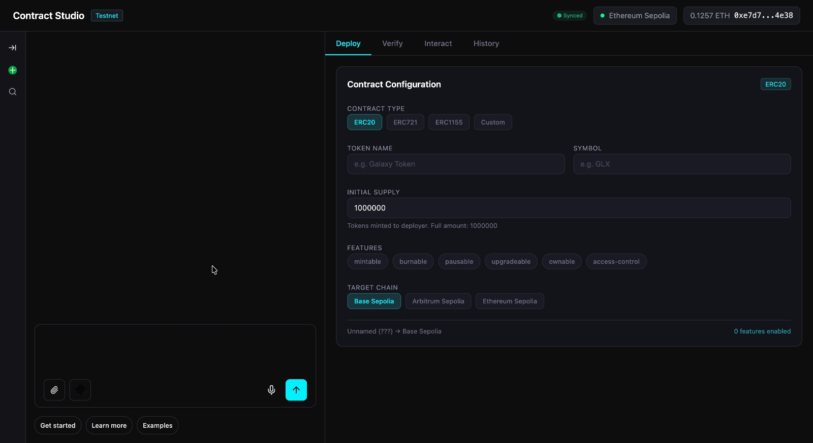

# Contract Studio 🏗️

> Deploy smart contracts through conversation. Built with [Tambo](https://tambo.co) generative UI.

Contract Studio is a conversational smart contract deployment platform that replaces the traditional multi-tool workflow — Remix, Hardhat, MetaMask, Etherscan — with a single AI-powered chat interface. Type what you want, and the AI deploys, verifies, and manages your contracts.

**🔗 [Live Demo](https://contract-studio.vercel.app)** · **📹 [Demo Video](https://youtu.be/O6s82qfyiKg)** · **🏆 Built for [Tambo "The UI Strikes Back" Hackathon](https://tambo.co)**



---

## ✨ Features

- **Conversational Deployment** — "Deploy an ERC-20 called Galaxy with 1M supply on Sepolia" → form generates, MetaMask signs, contract deploys
- **Contract Verification** — Etherscan verification via MCP server with elicitation for missing compiler details
- **Contract Interaction** — Mint, burn, pause, transfer tokens directly from chat
- **Multi-Chain Support** — Ethereum Sepolia, Base Sepolia, Arbitrum Sepolia
- **Security Audit** — AI-generated security analysis with severity scoring
- **Real-Time Blockchain Data** — Live gas prices, balances, and contract info via Etherscan MCP
- **Wallet Authentication** — MetaMask wallet signature-based auth
- **Persistent History** — Deployment history saved and synced across sessions

---

## 🏗️ Architecture

```
┌──────────────────────────────────────────────┐
│              CONTRACT STUDIO                  │
├───────────────────┬──────────────────────────┤
│    AI Chat        │    Dynamic Workbench     │
│    (Tambo)        │    (Generative UI)       │
├───────────────────┴──────────────────────────┤
│         LOCAL TOOLS (browser-side)            │
│  wallet · signing · transactions · network    │
├──────────────────────────────────────────────┤
│         MCP SERVERS (server-side)             │
│  Etherscan (6 tools) · Supabase (5 tools)    │
├──────────────────────────────────────────────┤
│   Next.js  ·  ethers.js  ·  TypeScript  ·    │
│   Tambo SDK  ·  Zod  ·  Recharts             │
└──────────────────────────────────────────────┘
```

Three layers:

- **Local Tools** run in the browser for wallet signing and transactions — things that can't happen server-side
- **MCP Servers** connect to Etherscan and Supabase for real-time blockchain data and persistence
- **Generative Components** render the UI dynamically — security audits, gas charts, deployment trackers — all streamed by the AI

---

## 🧩 Tambo Features Used (14/15)

| # | Tambo Feature | Implementation |
|---|---|---|
| 1 | **Generative Components** | SecurityAudit, GasEstimation, DeploymentTracker, StatusCard |
| 2 | **Interactable Components** | ContractParamsForm — AI fills fields, user edits, stays in sync |
| 3 | **Local Tools (9)** | connectWallet, switchNetwork, sendDeployTransaction, readContract, callContractFunction, estimateDeployGas, getContractTemplate, fetchGasPrices, submitVerification |
| 4 | **MCP Server — Etherscan** | getContractInfo, getTokenInfo, getGasPrice, getTransactionStatus, getAccountBalance, verifyContract |
| 5 | **MCP Server — Supabase** | Deployment history CRUD, user data persistence |
| 6 | **MCP Elicitation** | verifyContract requests compiler settings mid-execution when missing |
| 7 | **Context Helpers** | walletState, deployedContracts, currentView — AI always knows app state |
| 8 | **Suggestions** | Context-aware action chips that adapt per workflow stage |
| 9 | **System Prompt** | Custom instructions for deploy flow and tool chaining |
| 10 | **Streaming** | Progressive prop-level rendering on generative components |
| 11 | **Conversation Storage** | Thread persistence across sessions |
| 12 | **Thread History** | Sidebar with past conversations |
| 13 | **User Authentication** | MetaMask wallet signature → Tambo userToken |
| 14 | **Agent Configuration** | Model selection and custom LLM params via Dashboard |

Only **Canvas Space** (15th feature) was skipped — not relevant for this application.

---

## 🛠️ Tech Stack

| Layer | Technology |
|---|---|
| Framework | Next.js 14, TypeScript |
| AI / Generative UI | Tambo SDK (`@tambo-ai/react`) |
| Blockchain | ethers.js v6 |
| MCP Servers | Next.js API routes (Etherscan, Supabase) |
| Database | Supabase (PostgreSQL) |
| Styling | Tailwind CSS |
| Charts | Recharts |
| Schemas | Zod |
| Deployment | Vercel |

---

## ⚡ Quick Start

### Prerequisites

- Node.js 18+
- MetaMask browser extension
- Tambo API key ([get one free](https://tambo.co))
- Etherscan API key ([get one free](https://etherscan.io/apis))

### Setup

```bash
# Clone
git clone https://github.com/SAHU-01/contract-studio.git
cd contract-studio

# Install
npm install

# Environment
cp .env.example .env.local
```

Add your keys to `.env.local`:

```env
NEXT_PUBLIC_TAMBO_API_KEY=
ETHERSCAN_API_KEY=
NEXT_PUBLIC_ETHERSCAN_API_KEY=
NEXT_PUBLIC_SUPABASE_URL=
NEXT_PUBLIC_SUPABASE_ANON_KEY=
SUPABASE_SERVICE_ROLE_KEY=
```

```bash
# Run
npm run dev
```

Open [http://localhost:3000](http://localhost:3000) and start chatting.

### Testnet Setup

You need testnet ETH to deploy contracts:

- **Ethereum Sepolia** — [sepoliafaucet.com](https://sepoliafaucet.com)
- **Base Sepolia** — [faucet.quicknode.com/base/sepolia](https://faucet.quicknode.com/base/sepolia)
- **Arbitrum Sepolia** — [faucet.quicknode.com/arbitrum/sepolia](https://faucet.quicknode.com/arbitrum/sepolia)

---

## 📁 Project Structure

```
contract-studio/
├── src/
│   ├── app/
│   │   ├── layout.tsx              # TamboProvider, context helpers, system prompt
│   │   ├── page.tsx                # Main chat + workbench layout
│   │   └── api/
│   │       ├── mcp/
│   │       │   └── etherscan/
│   │       │       └── route.ts    # Etherscan MCP server (6 tools + elicitation)
│   │       └── auth/
│   │           └── wallet/
│   │               └── route.ts    # MetaMask wallet auth endpoint
│   ├── components/
│   │   ├── generative/             # AI-rendered components
│   │   │   ├── SecurityAudit.tsx
│   │   │   ├── GasEstimation.tsx
│   │   │   ├── DeploymentTracker.tsx
│   │   │   └── StatusCard.tsx
│   │   ├── interactable/           # Persistent, editable components
│   │   │   └── ContractParamsForm.tsx
│   │   ├── tabs/                   # Workbench tabs
│   │   │   ├── DeployTab.tsx
│   │   │   ├── VerifyTab.tsx
│   │   │   ├── InteractTab.tsx
│   │   │   └── HistoryTab.tsx
│   │   └── tambo/                  # Tambo UI components
│   ├── hooks/
│   │   └── useWalletAuth.ts        # Wallet auth hook
│   └── lib/
│       ├── tambo.ts                # Component + tool registration
│       ├── chains.ts               # Chain configs (Sepolia, Base, Arbitrum)
│       ├── contracts/              # ERC-20 ABI + bytecode templates
│       └── supabase.ts             # Supabase client
├── .env.local
└── package.json
```

---

## 🤖 AI Usage Disclosure

AI tools were used throughout the development of this project:

- **Claude (Anthropic)** — Breaking the hackathon project into phased milestones and daily implementation plans. Understanding Tambo's feature set and mapping features to concrete use cases. Debugging implementation issues including MCP server configuration and context helper bugs. Resolving context awareness integration bugs between Tambo's TamboProvider, local tools, and MCP servers. Writing README and refining the demo video voiceover copy.

- **ElevenLabs** — Text-to-speech generation for the demo video voiceover audio.

- **Midjourney / Image Generation** — Creating illustration assets for the demo video intro and architecture diagrams.

All code was written, tested, and deployed by the developer. AI was used as a development accelerator, not a code generator — every implementation was understood, reviewed, and adapted to the specific requirements of the project.

---

## Acknowledgments

- [Tambo](https://tambo.co) — Generative UI SDK
- [Etherscan](https://etherscan.io) — Blockchain explorer APIs
- [OpenZeppelin](https://openzeppelin.com) — ERC-20 contract templates
- [Supabase](https://supabase.com) — Database and authentication
